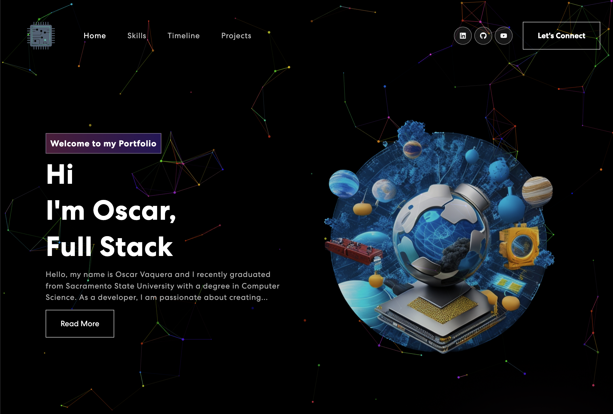
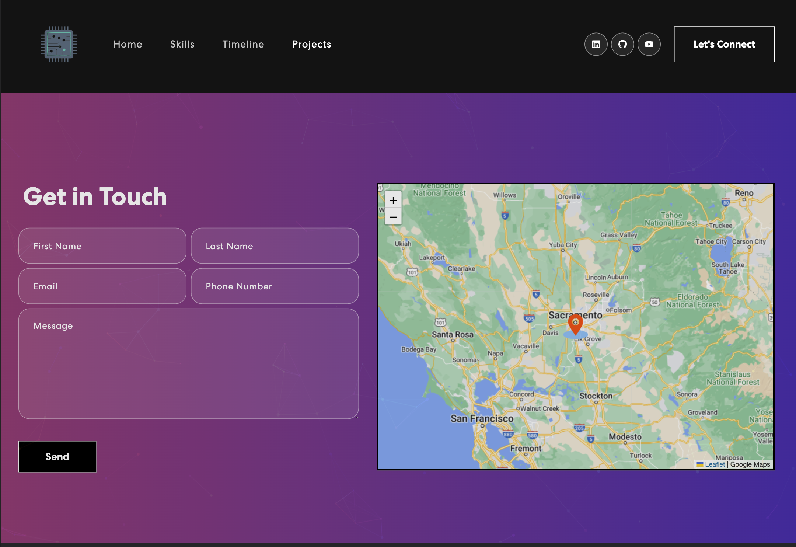
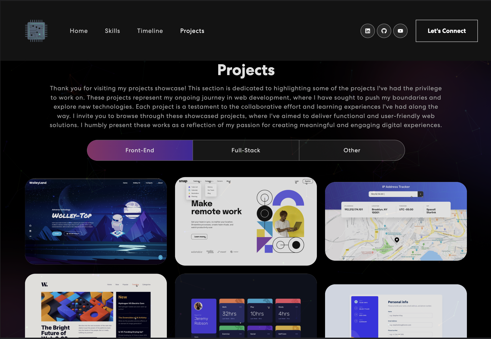
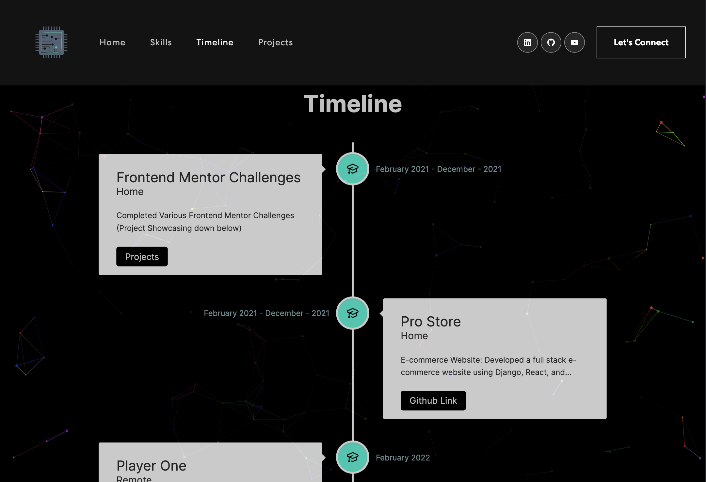
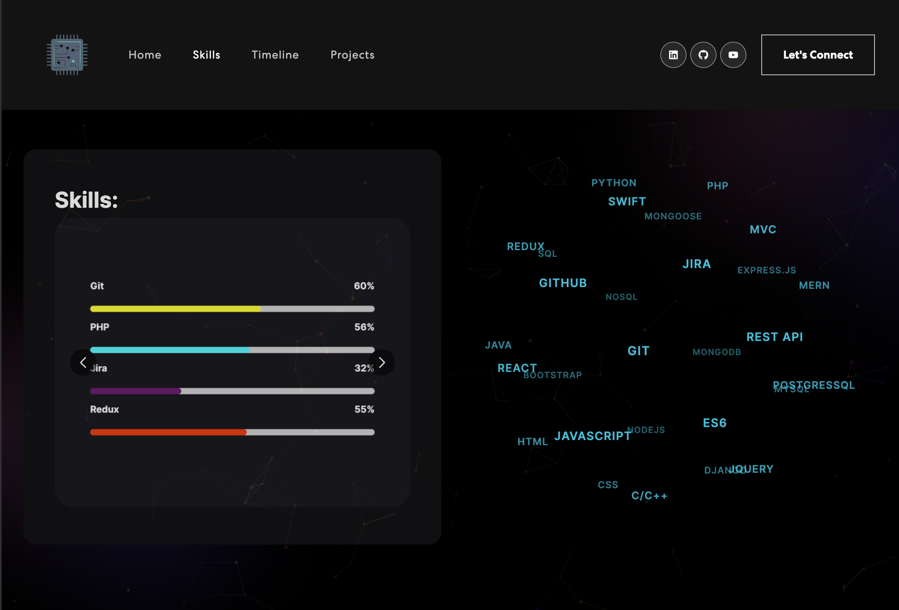

# Portfolio Project
Welcome to my personal portfolio project. Here, you will find comprehensive information about my skills as a programmer and detailed insights into my work. Thank you for visiting.

Feel free to explore the project and discover more about my capabilities, past projects, and professional background. The portfolio serves as a central hub to showcase my expertise and achievements in the field of programming.

Please visit the portfolio project to gain a comprehensive understanding of my skills, accomplishments, and the projects I have undertaken. It is designed to provide a clear picture of my abilities and highlights my dedication to delivering high-quality software solutions.

Thank you for taking the time to review my portfolio project. Should you have any inquiries or require further information, please do not hesitate to reach out.

## Table of Contents

- [Overview](#overview)
    - [Screenshot](#screenshot)
    - [Links](#links)
- [Built With](#built-with)
- [Usage](#Usage)
- [Contact](#Contact)

## Overview

### Screenshot

### Links

- [Click here to see the (Live Demo)](https://vaqueraoscar0.github.io/MyPortfolioWebsite)

## Built With

- React
- Axios
- TagCloud
- Nodemailer
- React Icons
- React Bootstrap
- React Multi Carousel
- React Vertical Timeline
- React Leaflet (for displaying the map)

## Usage

To use this project locally, follow these steps:

Clone the repository: git clone https://github.com/vaqueraoscar0/MyPortfolioWebsite.git
Install the dependencies: npm install
Start the development server: npm start
Open the application in your browser at http://localhost:3000

## Contact

If you have any questions, feedback, or would like to collaborate, please feel free to contact me:

Email: vaqueraoscar0@gmail.com

LinkedIn: https://www.linkedin.com/in/oscar-vaquera/

Portfolio: https://vaqueraoscar0.github.io/MyPortfolioWebsite

I am open to new opportunities and look forward to connecting with you.